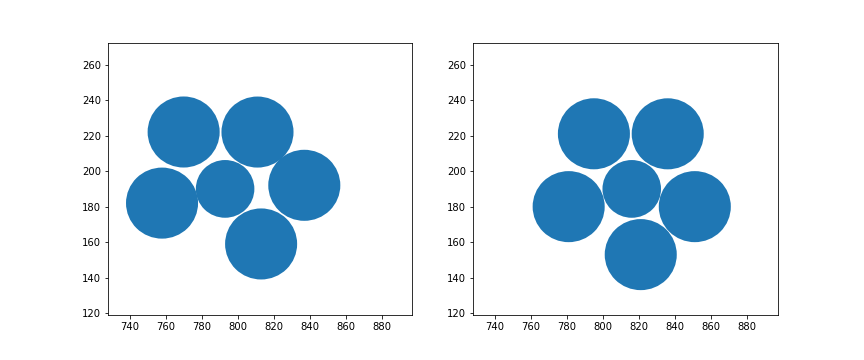

# Test Code

This folder contains a test initial and final state to demonstrate usage of the calculation, and compare with different implementations.

The test scenario is a small cluster of particles from Ryan Kozlowski's slider experiment at Duke:



See the Jupyter Notebook for example usage and results from this implementation of the calculation.

The expected values for this case are:

- D<sup>2</sup><sub>min</sub>:

```
45.17664958207952
```

- Uniform strain tensor:

```
 [[ 0.85612563  0.16744188]
 [-0.12802889  1.01981877]]
```

The D<sup>2</sup><sub>min</sub> value above is calculated for the central particle (1st point in the txt files) and is normalized to the number of bonds (5 in this case).
